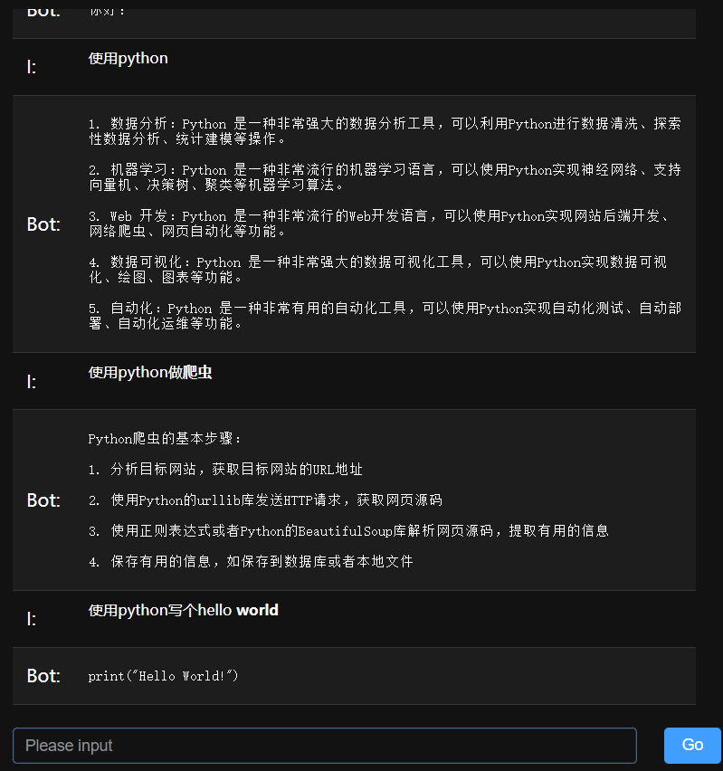

# OpenAiChat

这是一个使用[openai-api接口](https://beta.openai.com/docs/api-reference/completions/create)调用模型接口实现前端对话的web服务。



## Configuration

1. 获取[openai_key](https://beta.openai.com/account/api-keys)

2. 替换OpenAiChat.py内的 `openai.api_key = "sk-aaa"`

3. 默认使用text-davinci-003模型（[通用语言模型](https://beta.openai.com/docs/models/gpt-3)），与网页版的chatgpt是有区别的。

## Run

### local run

```
pip3 install -r requirements.txt
python3 OpenAiChat.py
```

### docker run

```
bash ./run.sh
```

## Use

访问8080端口即可